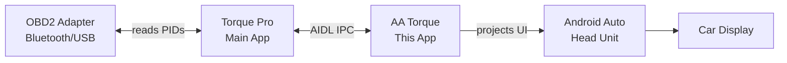
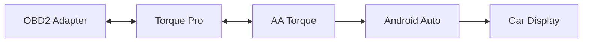
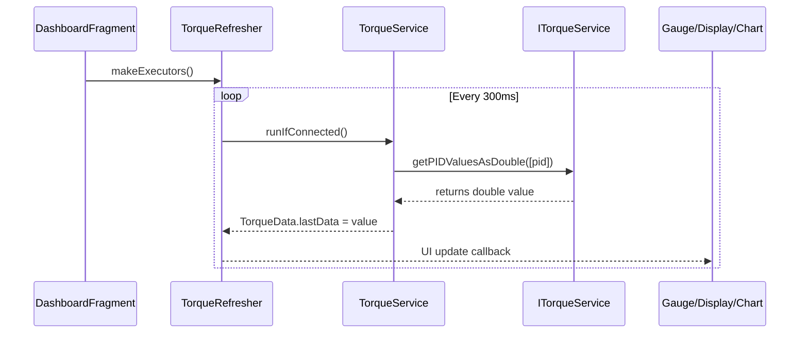
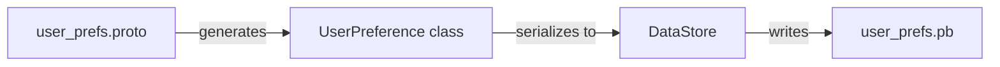
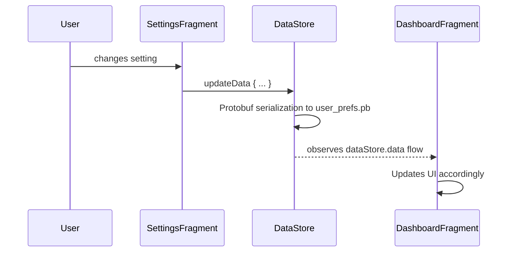
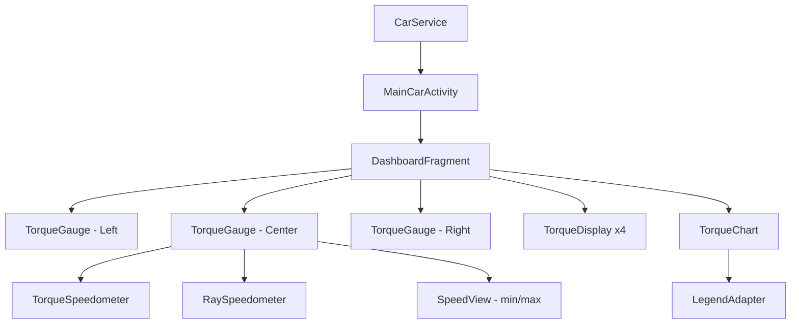
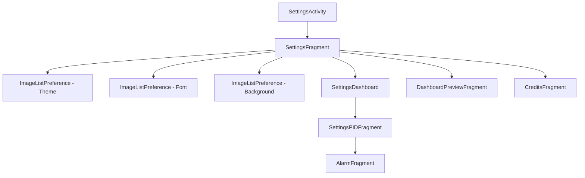
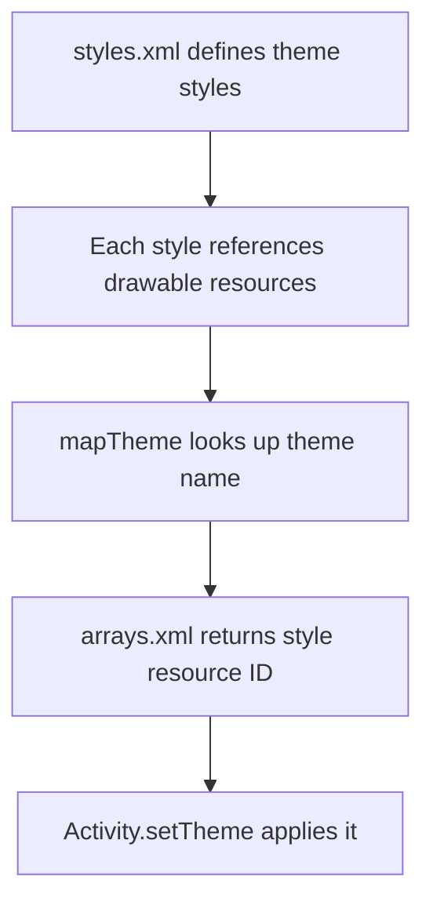
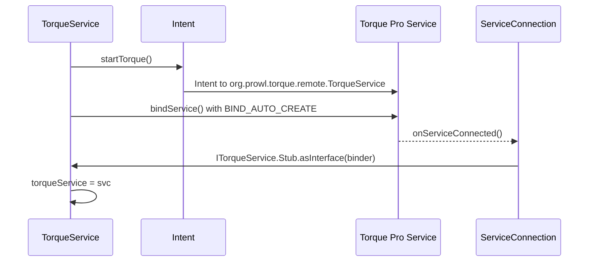

# AA Torque - Architecture Guide

This document explains the complete architecture of the AA Torque app, how components interact, and the data flow from OBD2 adapter to the car's Android Auto display.

---

## Table of Contents

1. [High-Level Overview](#high-level-overview)
2. [How It All Works (Data Flow)](#how-it-all-works-data-flow)
3. [Project Structure](#project-structure)
4. [Core Components](#core-components)
5. [Settings System](#settings-system)
6. [UI Layer](#ui-layer)
7. [Theme System](#theme-system)
8. [Protobuf Data Model](#protobuf-data-model)
9. [Inter-App Communication](#inter-app-communication)

---

## High-Level Overview

AA Torque is an Android Auto plugin app that displays real-time vehicle data from an OBD2 adapter on your car's head unit. It's a companion app to Torque Pro: it doesn't read OBD2 data directly. Instead, it communicates with Torque Pro via Android's IPC (Inter-Process Communication) system using AIDL.



---

## How It All Works (Data Flow)

### Connection Chain



### Detailed Flow

1. **OBD2 Adapter** connects to the car's ECU via Bluetooth/USB
2. **Torque Pro** reads PID data from the adapter (e.g., RPM, Speed, Coolant Temp)
3. **AA Torque** binds to Torque Pro's remote service via `ITorqueService.aidl`
4. **AA Torque** polls Torque Pro for PID values every 300ms (`REFRESH_INTERVAL`)
5. **AA Torque** displays data on gauges, charts, and text displays
6. **Android Auto** projects AA Torque's UI to the car's head unit

### PID Request Flow



---

## Project Structure

```
aa-torque/
├── app/                          # Main application module
│   ├── build.gradle              # App-level build configuration
│   ├── proguard-rules.pro        # R8/ProGuard rules
│   └── src/main/
│       ├── AndroidManifest.xml   # App manifest
│       ├── proto/                # Protocol Buffer definitions
│       │   └── user_prefs.proto  # User preferences schema
│       ├── aidl/                 # Android Interface Definition Language
│       │   └── org/prowl/torque/remote/
│       │       └── ITorqueService.aidl  # Torque API interface
│       ├── java/
│       │   ├── com/aatorque/     # Main app code
│       │   │   ├── stats/        # Dashboard & gauge UI components
│       │   │   ├── prefs/        # Settings/preferences system
│       │   │   ├── utils/        # Utility classes
│       │   │   └── ui/theme/     # Compose theme for alarm editor
│       │   └── org/prowl/torque/remote/
│       │       └── ITorqueService.java  # Auto-generated AIDL stub
│       └── res/                  # Android resources
│           ├── layout/           # XML layouts (data binding)
│           ├── values/           # Strings, colors, styles, arrays
│           ├── xml/              # Preference screens
│           ├── drawable/         # Icons, needles, dial backgrounds
│           └── font/             # Custom fonts (VW, Audi, Skoda, etc.)
├── lib/
│   ├── aauto.aar                # Android Auto SDK (binary)
│   └── speedviewlib/            # Speedometer/gauge library (submodule)
├── build.gradle                 # Top-level build configuration
├── settings.gradle              # Module declarations
├── version.properties           # Version number (2.0.30)
└── gradle/                      # Gradle wrapper
```

---

## Core Components

### 1. `CarService.java`: Android Auto Entry Point

```java
public class CarService extends CarActivityService {
    public Class<? extends CarActivity> getCarActivity() {
        return MainCarActivity.class;
    }
}
```

This is the entry point registered in AndroidManifest.xml. Android Auto calls this service to start the app on the car display. It returns `MainCarActivity` which hosts all the fragments.

### 2. `MainCarActivity.kt`: Car UI Host

- Extends `CarActivity` (from Android Auto SDK)
- Manages fragment switching (Dashboard, Credits, Stopwatch)
- Handles rotary input (scroll wheel on car stereos)
- Manages theme changes at runtime (recreates activity when theme changes)
- Handles keyboard events (DPAD_CENTER for chart toggle)

### 3. `DashboardFragment.kt`: Main Dashboard

This is the heart of the app. It:

- Hosts **3 gauge fragments** (left, center, right): `TorqueGauge`
- Hosts **4 text display fragments**: `TorqueDisplay`
- Hosts a **chart fragment**: `TorqueChart`
- Manages **screen switching** (up to 10 dashboards with swipe/rotary)
- Manages **album art background** from media sessions
- Observes user preferences via DataStore and updates all UI components
- Manages gauge opacity, blur effects, color filters

### 4. `TorqueService.kt`: IPC Bridge to Torque Pro

- Binds to Torque Pro's remote service via AIDL
- Manages the connection lifecycle
- Provides `runIfConnected()` to safely execute Torque API calls
- Handles disconnection and reconnection

### 5. `TorqueServiceWrapper.kt`: Settings-Side IPC Bridge

- Similar to `TorqueService.kt` but used in the Settings app (not car display)
- Loads PID information (names, units, ranges) from Torque
- Used by `SettingsDashboard` and `SettingsPIDFragment` to populate PID lists

### 6. `TorqueRefresher.kt`: Data Polling Engine

- Manages a `ScheduledThreadPoolExecutor` with 7 threads
- Polls each configured PID every 300ms (`REFRESH_INTERVAL`)
- Staggers requests across PIDs to avoid overwhelming the OBD2 adapter
- Manages connection status flow (`CONNECTING_TORQUE` -> `CONNECTING_ECU` -> `CONNECTED`)
- Caches `TorqueData` objects per screen to avoid unnecessary rebuilds

### 7. `TorqueData.kt`: PID Data Model

Each displayable item has a `TorqueData` instance that:

- Holds the current value, min/max history, and formatted string
- Applies custom EvalEx expressions for unit conversion
- Manages alarm states (color changes based on thresholds)
- Formats numbers with appropriate precision

### 8. `TorqueGauge.kt`: Gauge Fragment

- Displays a speedometer-style gauge using `TorqueSpeedometer` (custom)
- Supports needle indicator or high-vis ray mode
- Tick marks with values
- Min/max indicators (mark or text)
- Custom dial backgrounds per theme
- Alarm color overlays

### 9. `TorqueDisplay.kt`: Text Display Fragment

- Shows a single PID value as text with optional icon/label
- Used for secondary data points below/around the gauges
- Supports alarm color changes

### 10. `TorqueChart.kt`: Line Chart Fragment

- Real-time line chart using GraphView library
- Plots up to 3 PID values over time (22 seconds window)
- Color-coded lines with legend
- Shows scaled values (0-100%) for comparison across different units

---

## Settings System

### Two Settings Apps

AA Torque has two distinct settings interfaces:

1. **Phone Settings App** (`SettingsActivity`): Runs on the phone
2. **Car Dashboard** (managed by `DashboardFragment`): Runs on the car display

### Data Persistence: Protobuf + DataStore

User preferences are stored using Protocol Buffers (Protobuf) with AndroidX DataStore:



The `UserPreference` protobuf message contains:
- `screens`: Array of Screen objects (up to 10 dashboards)
- `selectedTheme`: Theme name string
- `selectedFont`: Font name string
- `selectedBackground`: Background drawable name
- `centerGaugeLarge`: Boolean for center gauge sizing
- `showChart`: Boolean for chart mode
- `albumArt`: Boolean for media background
- `opacity`, `blurArt`, `darkenArt`: Integers (0-100)
- `currentScreen`: Currently active dashboard index

### Preference Flow



---

## UI Layer

### Data Binding

The app uses Android Data Binding extensively. Layout XML files contain `<layout>` tags with `<data>` sections defining variables. Binding expressions like `@{showChart ? View.VISIBLE : View.GONE}` are used throughout.

### Fragment Hierarchy



### Settings Fragment Hierarchy



---

## Theme System

### How Themes Work

Each theme defines:

1. **Dial backgrounds** (PNG images for gauge faces)
2. **Needle images** (PNG at 12 o'clock position)
3. **Colors** (needle color, indicator color, mark color)
4. **Speedometer style** (indicator type, width, padding)

### Theme Application



### Custom Theme Attributes

The app uses custom attributes defined in `attrs.xml`:

- `themedNeedle`: Needle drawable
- `themedNeedleColor`: Needle color
- `themedDialBackground`: Dial with marks
- `themedEmptyDialBackground`: Dial without marks
- `themedBlankDialBackground`: Plain dial
- `themedCarBackground`: App background
- `themedStopWatchBackground`: Stopwatch background

### Adding a New Theme

1. Add PNG assets (needle, dial backgrounds) to `res/drawable/`
2. Add a new style in `styles.xml` extending `AppTheme.Car.Speedometer`
3. Add theme name to `Themes` array in `arrays.xml`
4. Add theme style to `ThemeList` array in `arrays.xml`
5. Add thumbnail to `ThemesThumbs` array in `arrays.xml`

---

## Protobuf Data Model

### Schema Definition (`user_prefs.proto`)

```protobuf
message UserPreference {
  int32 currentScreen = 11;
  bool showChart = 22;
  repeated Screen screens = 8;
  string selectedTheme = 16;
  string selectedFont = 17;
  string selectedBackground = 18;
  bool centerGaugeLarge = 21;
  bool albumArt = 24;
  uint32 opacity = 25;
  uint32 blurArt = 26;
  uint32 darkenArt = 27;
}

message Screen {
  string title = 5;
  repeated Display gauges = 6;
  repeated Display displays = 7;
}

message Display {
  bool disabled = 25;
  string pid = 1;
  bool showLabel = 2;
  string label = 3;
  string icon = 4;
  int32 minValue = 9;
  int32 maxValue = 10;
  string unit = 12;
  bool enableScript = 13;
  string customScript = 14;
  bool wholeNumbers = 15;
  bool ticksActive = 21;
  MaxControl maxValuesActive = 22;
  MaxControl maxMarksActive = 23;
  bool highVisActive = 19;
  int32 chartColor = 24;
  repeated Coloring alarms = 26;
}
```

### Regenerating Protobuf Classes

```bash
# Classes are auto-generated during build
# To force regeneration:
./gradlew generateProto
```

Generated classes go to `app/build/generated/source/proto/`.

---

## Inter-App Communication

### AIDL Interface (`ITorqueService.aidl`)

The AIDL interface defines how AA Torque communicates with Torque Pro. Key methods:

| Method | Description |
|--------|-------------|
| `listAllPIDs()` | Returns all available PID IDs |
| `getPIDInformation(String[])` | Returns PID details (name, unit, min, max) |
| `getPIDValuesAsDouble(String[])` | Returns current PID values |
| `isConnectedToECU()` | Checks ECU connection status |
| `setDebugTestMode(boolean)` | Enables simulated data for testing |

### Connection Flow



### PID Naming Convention

PIDs are identified as `torque_<hex_id>`:
- `torque_0c,0`: Engine RPM (PID 0x0C)
- `torque_0d,0`: Vehicle Speed (PID 0x0D)
- `torque_05,0`: Coolant Temperature (PID 0x05)

---

## Key Libraries

| Library | Purpose |
|---------|---------|
| `aauto.aar` | Android Auto SDK (binary) |
| `speedviewlib` | Speedometer/gauge widgets |
| `graphview` | Line chart for real-time data |
| `EvalEx` | Mathematical expression parser |
| `Timber` | Logging |
| `ACRA` | Crash reporting |
| `Protobuf` | Data serialization |
| `DataStore` | Preferences storage |
| `Compose` | Alarm editor UI |

---

## Honda Elevate Notes

Your 2025 Honda Elevate uses Honda's infotainment system. Android Auto support depends on:

- Whether Honda India enables Android Auto on your specific trim
- The head unit resolution (affects layout)
- Rotary dial support (if equipped)

AA Torque's layout adapts to screen size via ConstraintLayout and percentage-based guidelines. Most Honda head units use a standard 800x480 or 1280x720 resolution, which the app handles well.
